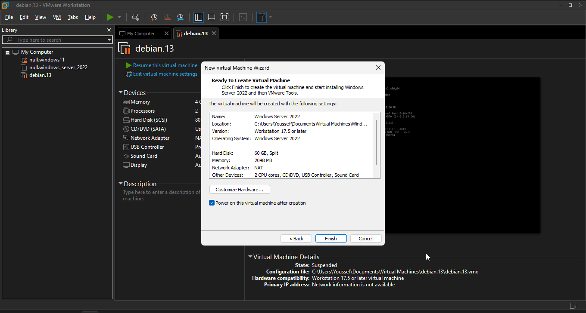

# Active Directory Lab Documentation - Part 1

## Overview
In this lab, I demonstrate my ability to set up and configure **Windows Server 2022** in a VMware environment.  
The initial steps involve preparing the virtual machine, installing the operating system, and getting the server ready for **Active Directory Domain Services (AD DS)**.  
This documentation is structured to help recruiters, hiring managers, and technical reviewers clearly see my process and technical skills.

## Steps and Screenshots

### 1. Creating the Virtual Machine

I began by creating a new virtual machine in **VMware Workstation Pro** and selecting the Windows Server 2022 ISO for installation.  

### 2. Configuring Virtual Machine Settings

Before installation, I ensured the virtual machine was configured with sufficient resources (CPU, RAM, and storage).  

### 3. Easy Install — Windows Server Edition Selection

Because VMware automatically detected the Windows Server 2022 ISO, it used **Easy Install**.  
This meant I didn’t see the usual “Install Now” or edition-selection screens. Instead, I directly chose:  

- **Windows Server 2022 Standard (Desktop Experience)**  

## Notes
If you are **not using VMware Easy Install**, you will normally see these steps:  
1. Selecting **Install Now** from the Windows Setup screen.  
2. Choosing an edition (e.g., *Standard Evaluation (Desktop Experience)*).  

Since Easy Install handled this automatically, those steps were skipped in my environment.

### 4. Installation Progress

The operating system installation was carried out successfully as shown below.  

### 5. Server Manager Dashboard

After login, the Server Manager automatically launched, providing a central interface to manage roles and features.  

### 6. Renaming the Server

To follow best practices, I renamed the server to **Rana-DC01**, which represents my lab’s Domain Controller.  

### 7. Configuring DNS

I configured the server’s IP address to also act as its DNS, which is essential for Active Directory environments.  

  

### 8. Starting Role-Based Installation

Next, I initiated the **Role-based or feature-based installation** process to prepare for AD DS.  

### 9. Selecting the Target Server

From the server pool, I selected **Rana-DC01** to install the roles.  

## Conclusion

At this stage, the server has been set up and prepared for **Active Directory installation**.  
This demonstrates my ability to configure a base **Windows Server 2022 environment**, a skill directly applicable in enterprise IT environments.
