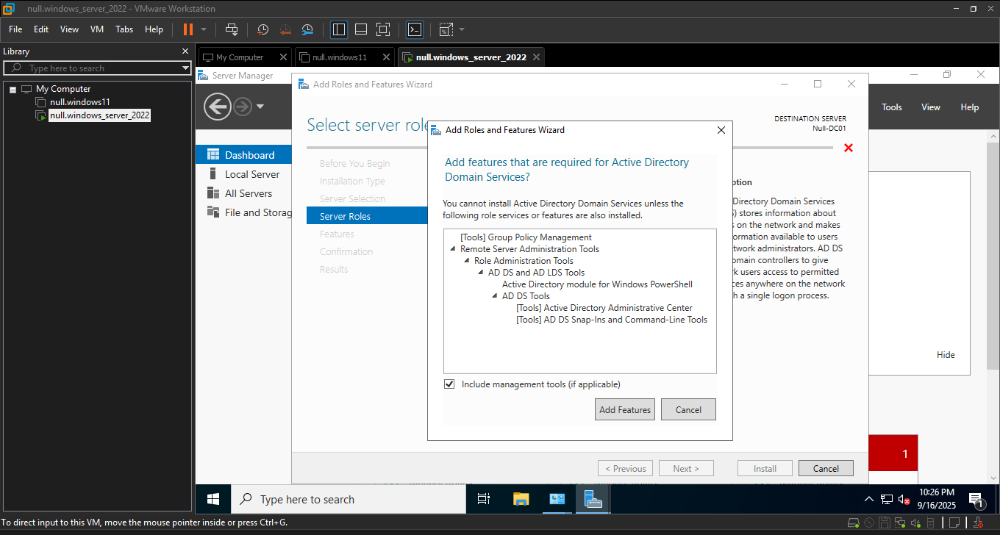
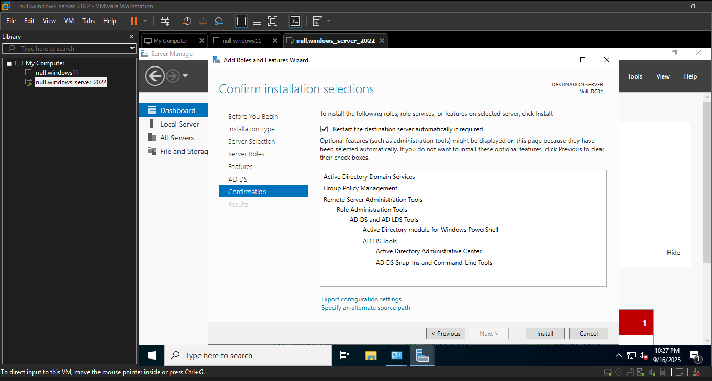
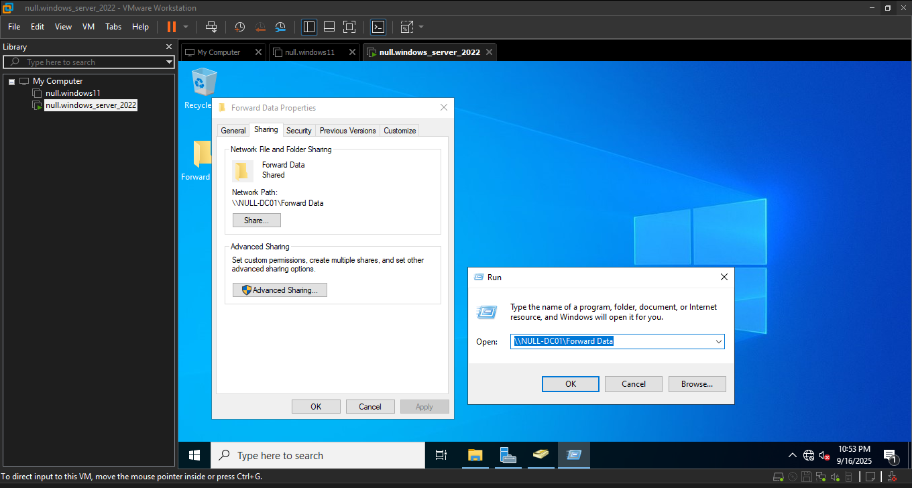
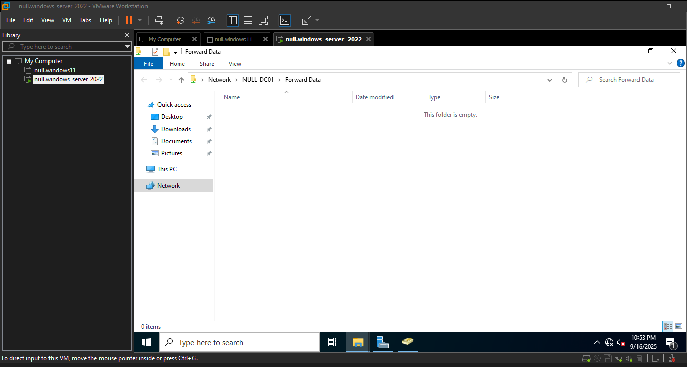
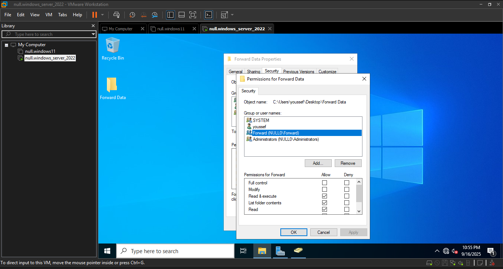

# Active Directory Lab Documentation - Part 2

## Overview
In this section of the lab, I focus on installing **Active Directory Domain Services (AD DS)**, promoting the server to a **Domain Controller**, and then creating and managing Active Directory objects.  
Additionally, I configure a **shared folder with role-based access control (RBAC)** to showcase my understanding of enterprise security practices.

---

## Steps and Screenshots

### 10. Installing AD DS Role

I selected **Active Directory Domain Services (AD DS)** as the server role.  

---

### 11. Confirming Installation Settings

Before installation, I confirmed the selections to ensure the correct role and features were applied.  

---

### 12. Server Promoted to Domain Controller

After promotion, the Server Manager dashboard displayed the **AD DS** and **DNS** roles.  

---

### 13. Creating a User Object

I created a new Active Directory user named **Kylian Mbappe** to demonstrate user management.  

---

### 14. Group Membership Management

I created a security group named **Forward Group** and added Mbappe as a member.  

---

### 15. Creating a Shared Folder

I created a folder called **Forward Data**, placed it on the server desktop, and shared it across the network.  

---

### 16. Accessing the Shared Folder from Network

Using the **Run** command and server name, I verified that the folder was accessible over the network.  

---

### 17. Confirming Network Share Availability

The shared folder appeared successfully on the network.  

---

### 18. Applying Permissions via RBAC

Finally, I granted **Forward Group** permissions to the folder, ensuring secure access control.  

---

## Conclusion

By completing these steps, I successfully:  
- Promoted the server to a **Domain Controller**  
- Created and managed **AD users and groups**  
- Implemented **folder sharing with RBAC**  

This part of the lab highlights my ability to manage **Active Directory** and apply **security best practices**, which are critical skills for IT support and system administration roles.
