# Active Directory GPO Lab

## Overview  
In this lab, I practiced Group Policy Object (GPO) management within Active Directory.
The tasks focused on:
- Restricting Control Panel access
- Configuring an auto-lock screen policy
- Allowing local logon for domain users
- Allowing Remote Desktop login for domain users

These exercises helped me understand how GPOs are created, edited, linked to Organizational Units (OUs), and tested with domain accounts to control system behavior and access policies.

## Steps and Screenshots  

### Task 1: Restricting Control Panel Access  

- I created a new GPO named **Restrict Control Panel Access**. 

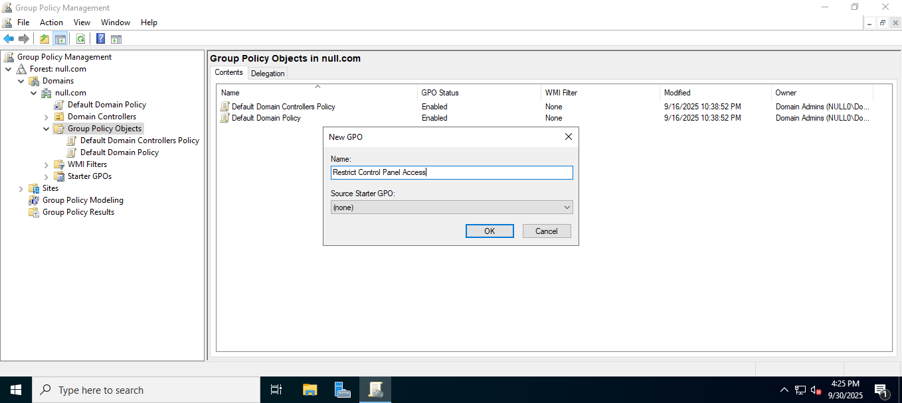  

- Edited the GPO to configure **Prohibit access to Control Panel and PC settings** (Enabled the restriction policy).
  
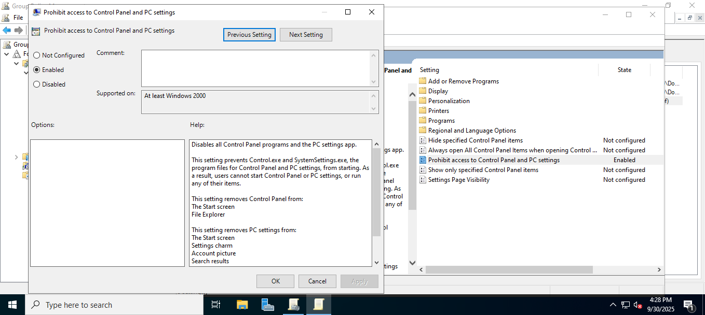  

- Linked the GPO to **Management, Marketing, and Sales OUs**. 

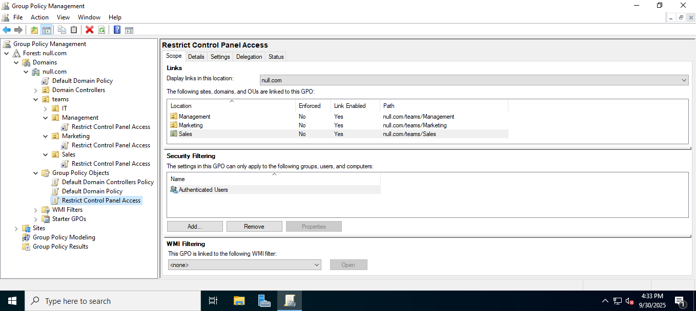  

### Task 2: Configuring Auto-Lock Screen Policy 

- Created a new GPO named **Auto Lock Screen**. 

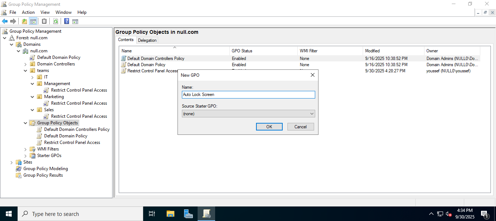  

- Linked it to the **Root Domain**.  

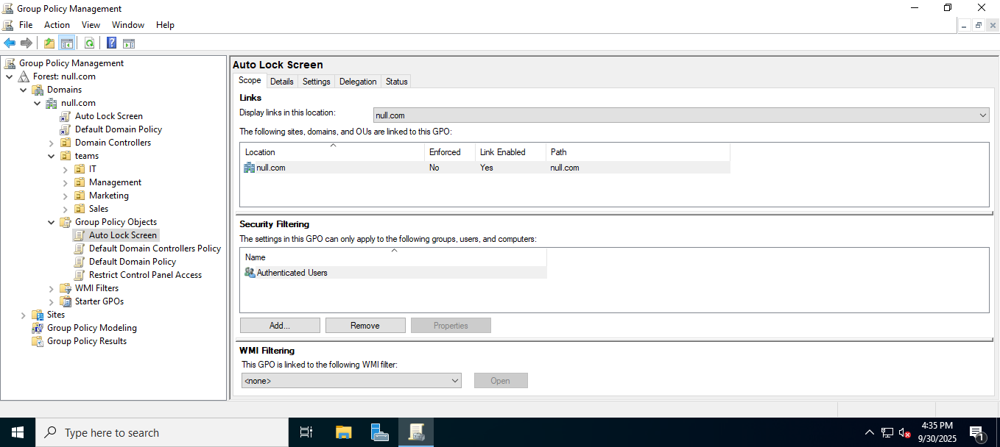  

- Configured the **Machine Inactivity Limit** to 600 seconds (10 minutes). 

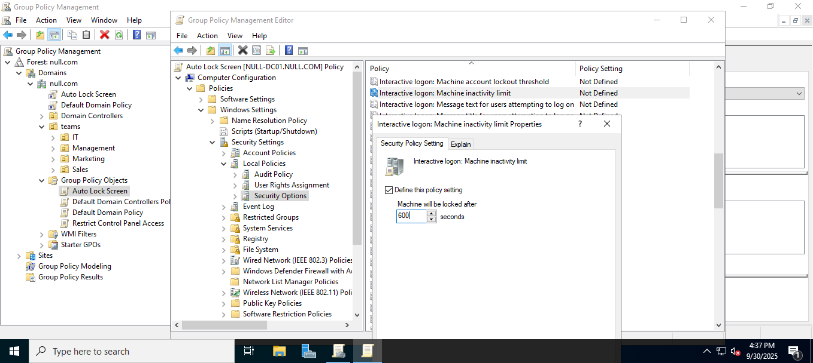  

### Task 3: Allowing Both Local and Remote Desktop Logon for Domain Users

> “The sign-in method you’re trying to use isn’t allowed.”
> This happens when the Allow log on locally right is not granted.
> i added the user **integrity** to the **Account Operators** group to allow log in directly in my server vm machine

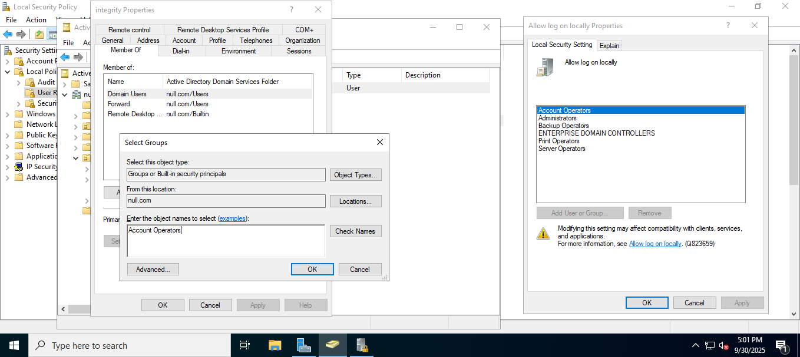  

To allow domain users to sign in via RDP, we must grant them the Allow log on through Remote Desktop Services
By adding users to **Remote Desktop Users** group

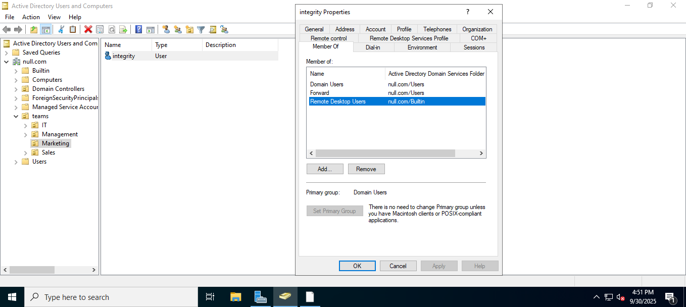  

### Task 4: Testing the Policies  

- Used the domain user **integrity** in the **Marketing OU** for testing.

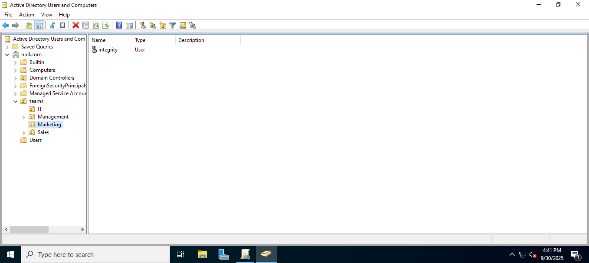  

- Verified domain login via **RDP** using integrity's credentials.  

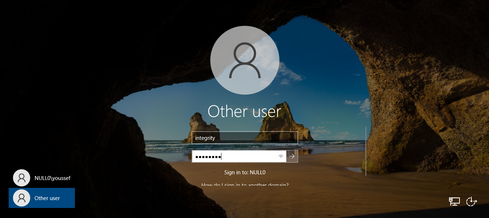  

- Attempted to open Control Panel – restriction worked as expected. 

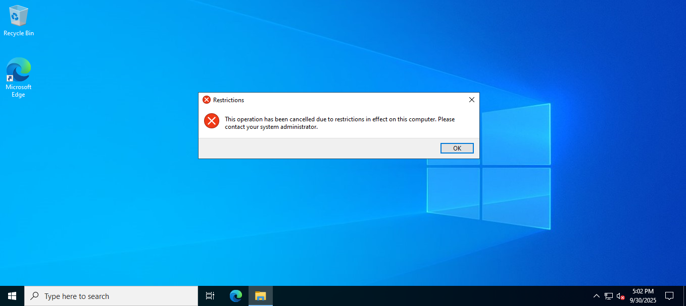  

- Waited for 5 minutes – user session logged out automatically.  

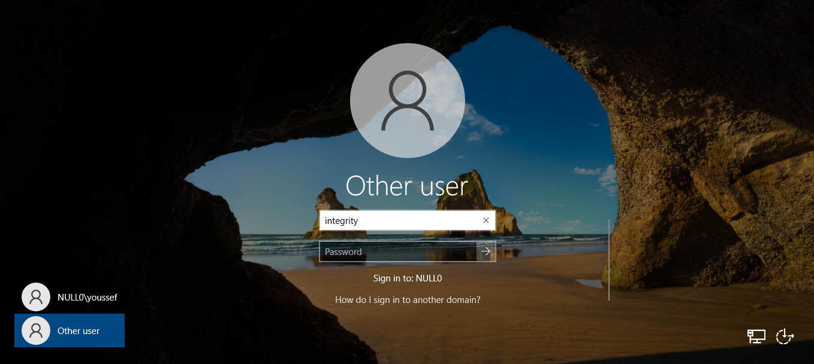  

## Conclusion  

This lab demonstrated how to create and manage Group Policy Objects in Active Directory.  
I successfully implemented policies to restrict Control Panel access and enforce auto-lock after inactivity.  
By linking these policies to OUs and testing with a domain user, I gained hands-on experience in applying security and productivity-related policies within an AD environment.  
