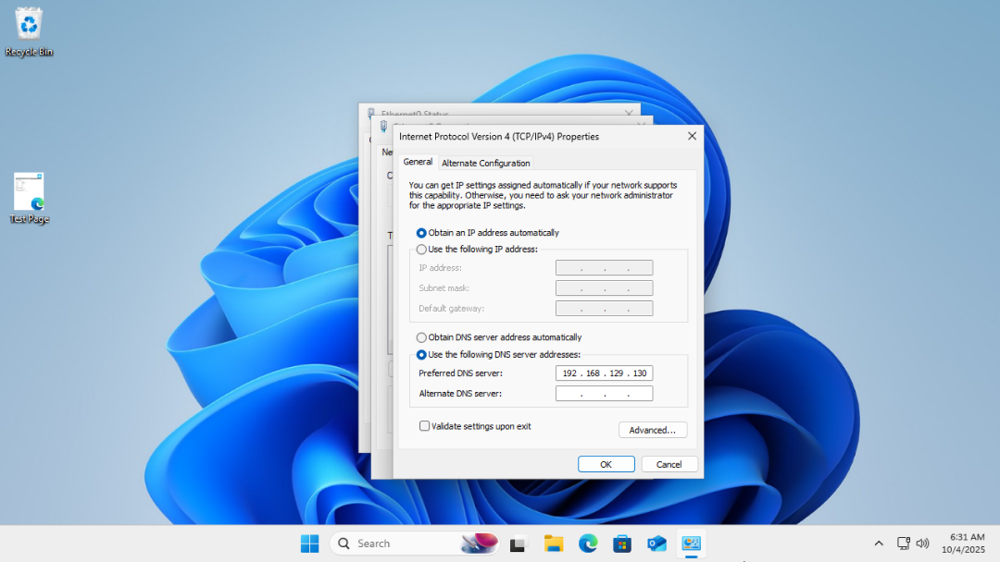
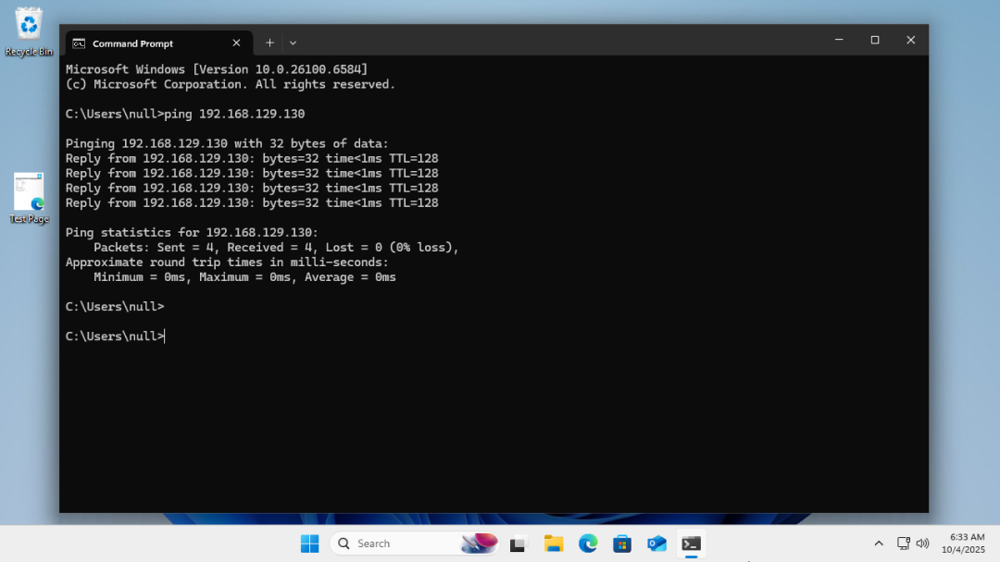
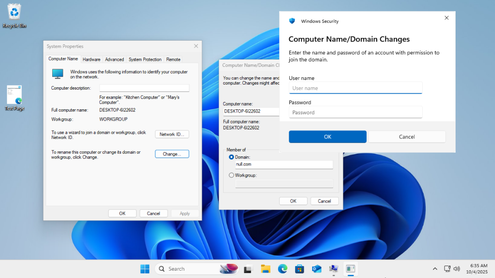
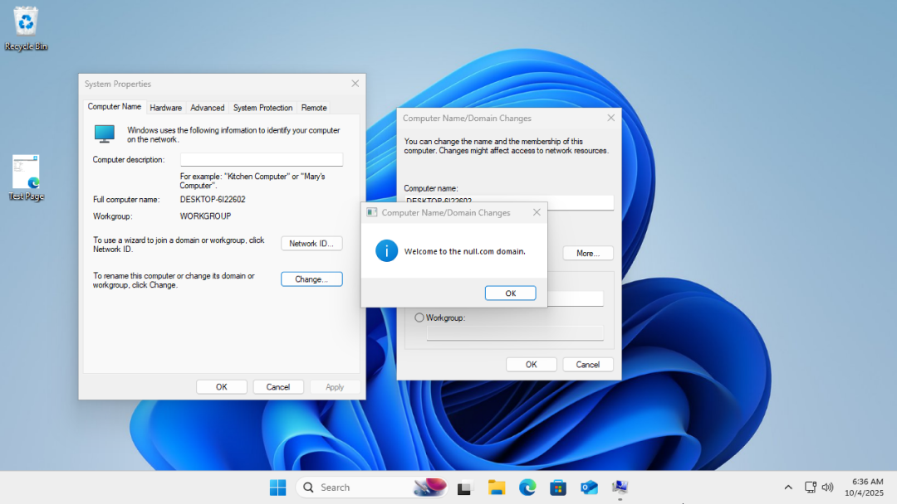
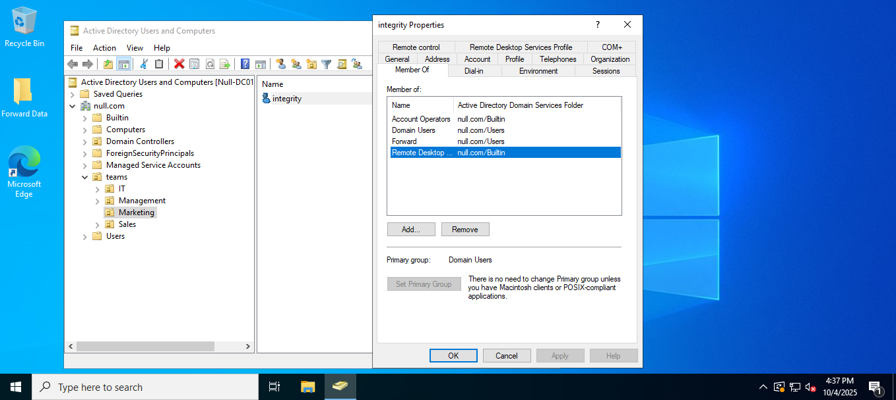
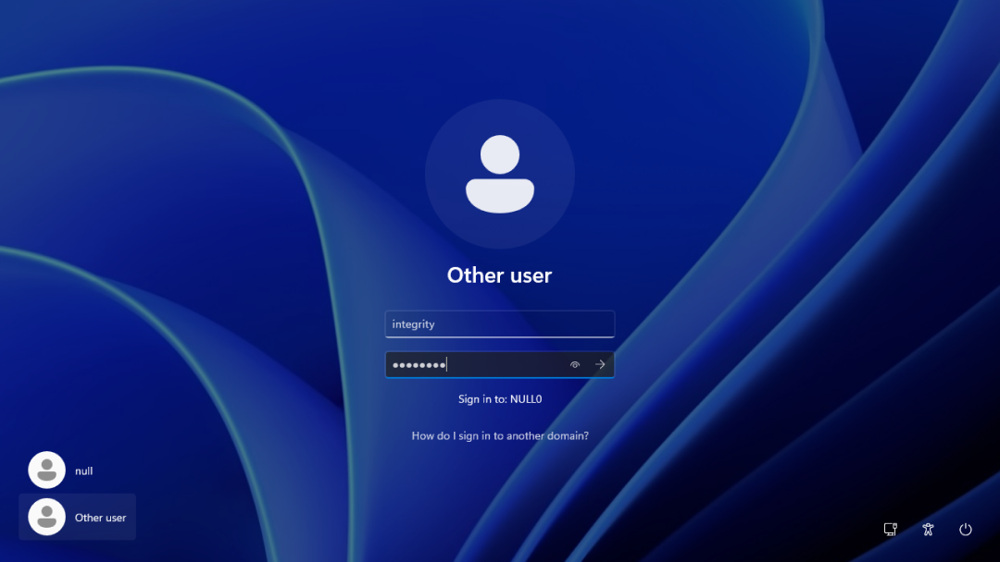

# Active Directory Lab – Joining a VM to the Domain

## Overview  
In this lab, I practiced **joining a client virtual machine (VM) to an existing Active Directory domain**.  
The tasks focused on:
- Creating a new Windows VM  
- Configuring network settings to connect to the domain  
- Joining the VM to the domain controller  
- Testing domain login  

This exercise helped me understand how to prepare client machines for domain membership and test domain user access.

## Steps and Screenshots  

### Task 1: Create a New VM  

- Created a new Windows VM.
- Allocated resources: 2 CPU cores, 4GB RAM, 60GB disk.  
- Installed Windows on the VM.  

### Task 2: Configure Network Settings  

- Set the VM to use the same subnet as the domain controller.  
- Configured **DNS** to point to the domain controller’s IP.  

  

- Tested connectivity by pinging the domain controller:  

  

### Task 3: Join the VM to the Domain  

- Opened **System Properties → Computer Name → Change → Domain**.  
- Entered the domain name (e.g., `null.com`).  
- Provided **domain credentials** with permission to join computers.  

  
  

- Restarted the VM to apply domain settings.  

### Task 4: Add Domain User to Remote Desktop Users Group  

- Added the domain user **integrity** to the group.  
- This ensures the user can log in via Remote Desktop.  

  

### Task 5: Test Domain Login  

- At the login screen, selected **Other User**.  
- Entered the **domain username and password**

  

- Verified successful login and desktop access.

## Conclusion  

This lab demonstrated how to prepare a client VM to join an Active Directory domain.  
I successfully completed the following tasks:  
- Created and configured a Windows VM  
- Configured network settings and DNS for domain connectivity
- Added the domain user to the Remote Desktop Users group  
- Joined the VM to the domain controller  
- Verified domain login using a domain user  

By completing these tasks, I gained hands-on experience in **joining machines to a domain and managing access for domain users**, which is a foundational skill in Active Directory administration.
