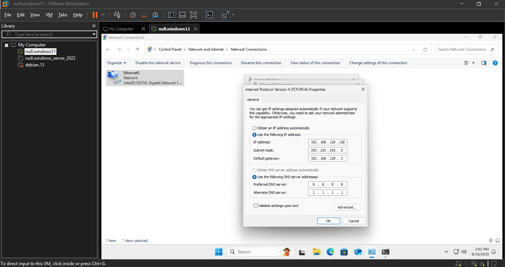

# Lab 01 — Basic Network Troubleshooting

---

## Overview
In this lab, I practiced:
- Troubleshooting network issues on a Windows 11 VM.  
- I captured a healthy baseline, then intentionally misconfigured DNS and the default gateway to simulate real-world problems.  
- Finally, I documented how each issue was diagnosed and resolved.

---

## Step 1 — Baseline
Commands executed:
```bat
ipconfig /all
ping 8.8.8.8
ping google.com
tracert google.com
nslookup google.com
```
**Observation:** 

All connectivity and DNS resolution worked correctly.

**Screenshot:**

 

---

## Step 2 — Fault Injection: DNS Misconfiguration

1. Changed **DNS server** to an invalid value:`99.88.77.66`  

     

3. Flushed **DNS cache**, Retested with **`ping`** and **`nslookup`**.
   ```bat
   ipconfig /flushdns
   ```
    

**Observation:**  
- `ping 8.8.8.8` succeeded (Internet reachable by IP)  
- `ping www.microsoft.com` failed (`could not find host`)  
- `nslookup` failed to resolve  

**Resolution:**

 Restored **valid DNS (8.8.8.8)**. Verified that name resolution worked again.  
   
   
   
---

## Step 3 — Fault Injection: Missing Gateway

1. Removed **Default Gateway** from IPv4 settings.

    

3. Retested connectivity.

      

**Observation:**  
- `ping 8.8.8.8` Failed 
- `ping google.com` Failed (Could Not Find Host)  
- `tracert 8.8.8.8` (Transmit Error)   
   
**Resolution:** 
 
 Restored correct **Default Gateway**. Confirmed Internet access restored. 
   
   
   
    
   
    
   

---

## Conclusion
This lab demonstrated how to:
- Use `ipconfig`, `ping`, `tracert`, and `nslookup` to diagnose issues  
- Differentiate between **DNS issues** and **Routing issues**  
- Simulate and fix real-world connectivity problems  
