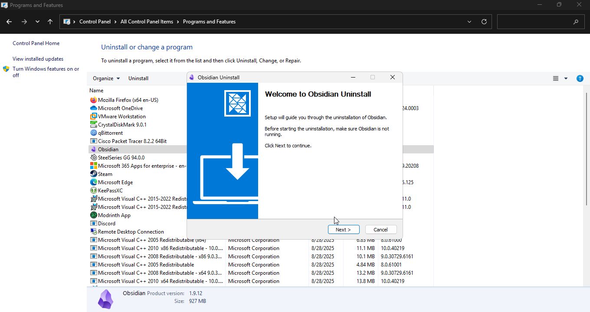

# Lab 02 - PC Performance Troubleshooting (Local Host, Windows OS)

## Overview
In this lab, I performed PC performance troubleshooting on my personal computer (local host) instead of a VM.  
I demonstrated practical methods for improving the performance of a Windows 11 system.
The steps include managing startup applications, uninstalling unnecessary programs, cleaning up storage, adjusting power settings, running security scans, and verifying disk health.
These actions typically result in faster boot times, reduced resource usage, improved responsiveness, and a more secure and stable system.

---

### 1. Checking Startup Applications

- Using Task Manager > Startup, I reviewed programs set to run automatically and disabled unnecessary ones to reduce boot time.

    
    

### 2. Uninstalling Unnecessary Applications

- From Control Panel > Programs and Features, I identified and uninstalled unused applications that consumed resources.

    
    
    

### 3. Running Disk Cleanup

- I ran Disk Cleanup to remove temporary files, cache, and system clutter, freeing up storage space.

      
      
    
    

### 4. Setting Power Plan to High Performance

- I changed the Power Plan from Balanced to High Performance to maximize system responsiveness.

    
    
    

### 5. Running a Security Scan

Using Windows Security, I performed a Quick Scan to ensure that no malware was affecting performance.

  
  
  
### 6. Checking Drive Health with CHKDSK

To verify storage integrity, I ran the following command in Command Prompt:

```bat
chkdsk C:
```

  
  

---

## Conclusion

This lab demonstrated practical steps for troubleshooting and improving PC performance:

- Managing startup and installed applications
- Freeing space with Disk Cleanup
- Ensuring system security and disk health
- Adjusting power settings for better responsiveness
- Monitoring resource usage in real time

These are essential skills for IT support roles, where users often report performance issues.
