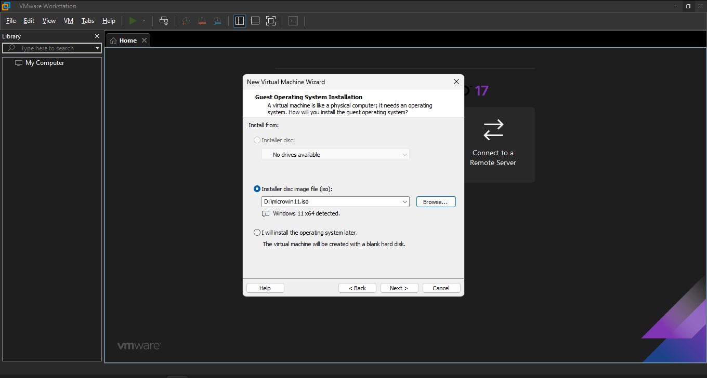
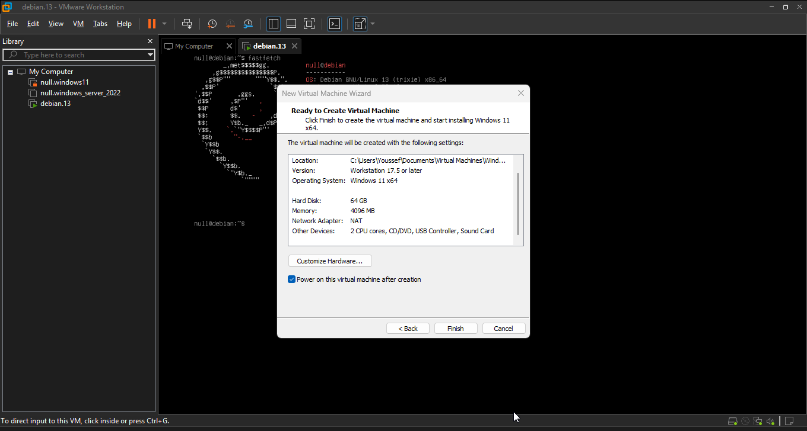
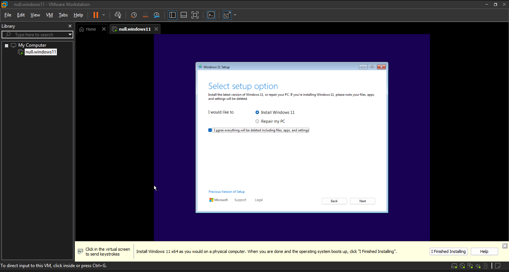
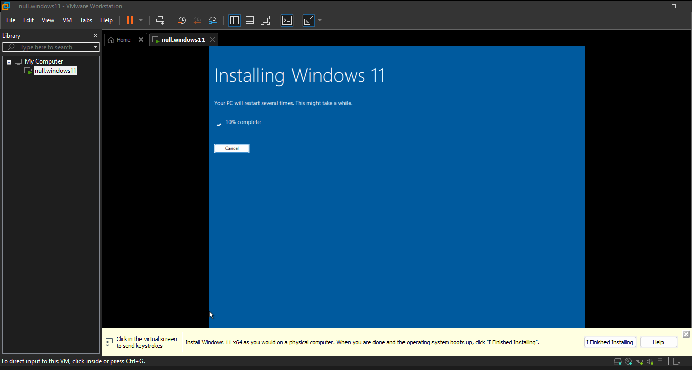
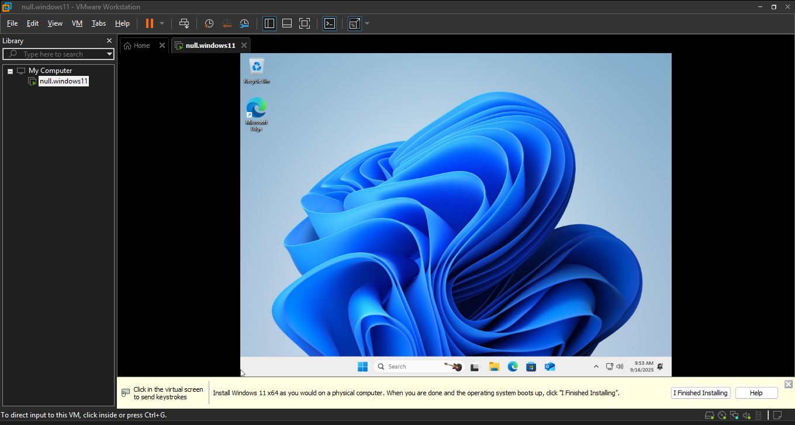
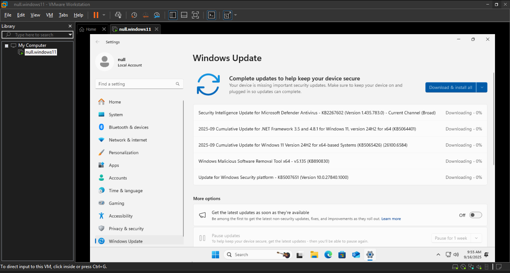
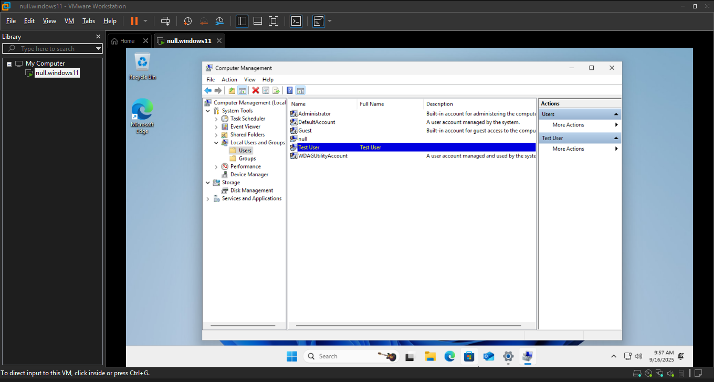

# Windows 11 Installation & Configuration Lab

## Overview
This lab demonstrates a clean installation and configuration of **Windows 11** in a VMware Workstation Pro environment.  
It reflects a real-world IT Service Desk scenario where a new user device is provisioned, updated, and configured with the necessary drivers and user accounts.

**Note on ISO used:**  
For this lab (and most of my personal setups), I used the official Windows 11 ISO from Microsoft, but slightly **debloated** using [Chris Titus Tech’s MicroWin utility](https://github.com/ChrisTitusTech/winutil).  
- This step simply removes unnecessary bloatware and background services to improve performance.  
- The installation and configuration process is otherwise identical to using the standard ISO.  
- For those interested, Chris Titus Tech provides a walkthrough here: [YouTube Guide](https://www.youtube.com/watch?v=f8SRqHCsrkk).  

> ⚠️ You can also use the **regular official Windows 11 ISO** for the same lab steps without issues. This is just personal preference.

---

## Steps and Screenshots

### 1. Creating a New Virtual Machine
I began by creating a new VM in **VMware Workstation Pro** and selected the Windows 11 ISO image.

**Screenshot:**  

### 2. Configuring Virtual Machine Resources

I allocated resources to meet the **minimum requirements for Windows 11**:

- **Processors:** 2 cores  
- **Memory (RAM):** 4 GB  
- **Hard Disk:** 64 GB  

**Screenshot:**  

### 3. Starting Windows Setup

When the VM booted, I proceeded with the installation and selected the language and regional preferences.  

### 3. Choosing Installation Option

I chose to install Windows 11 as a new installation.  

### 4. Selecting Windows 11 Edition

On a standard Microsoft Windows 11 ISO, you will be prompted to select which edition to install.  
For IT and enterprise environments, **Windows 11 Pro** is the recommended choice, since it supports domain joining, Group Policy, BitLocker, and other enterprise features.

⚠️ **Note:**  
Because I used a debloated ISO created with [Chris Titus Tech’s MicroWin utility](https://github.com/ChrisTitusTech/winutil), this screen was skipped during my installation.  
If you are using the **official Microsoft ISO**, you will see this step and should select **Windows 11 Pro**.

### 5. Installation in Progress

The setup began installing Windows 11 files and features.  

### 6. First Login to Windows 11

The system loaded to the Windows 11 desktop after initial configuration.  

### 7. Windows Updates

I launched **Windows Update** and allowed the system to download the latest patches. 

  

### 8. Creating an Additional Standard User

To follow security best practices, I added another standard user account in addition to the administrator.

## Conclusion

This lab successfully demonstrates the end-to-end process of deploying a new Windows 11 workstation: 
- Performing a clean installation
- Applying updates
- Configuring user accounts
- Ensuring the system is ready for use in a professional environment. 

This mirrors real-world IT administration tasks when preparing machines for end-users.
