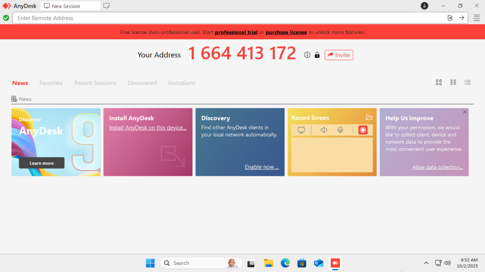
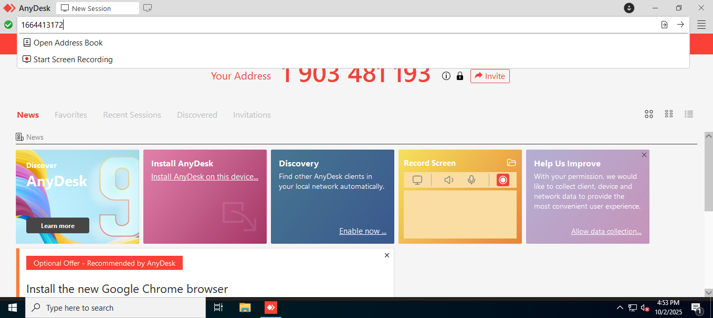
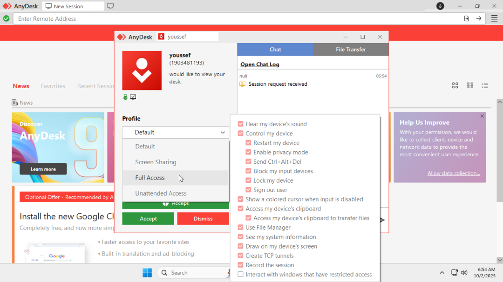
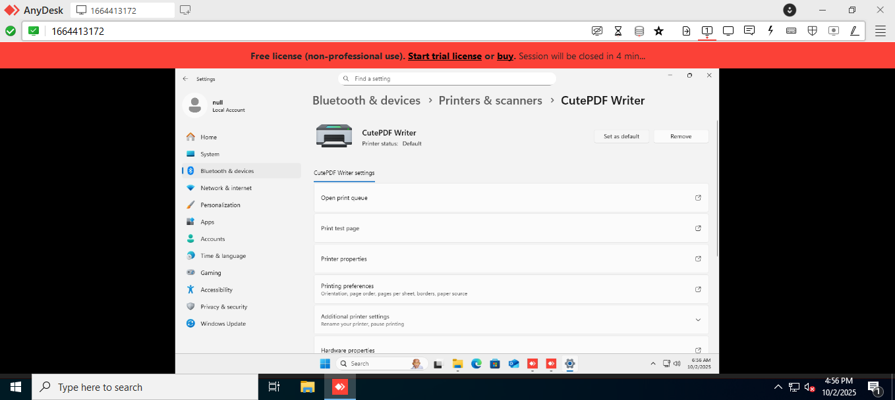
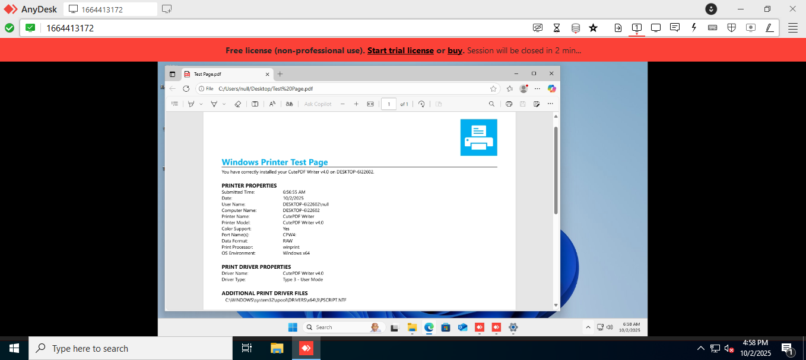

# Remote Support Tools Lab — AnyDesk (Windows 10/11, No Physical Printer)

## Overview
This lab demonstrates the use of AnyDesk to remotely support an end-user by setting a default printer and confirming functionality using a virtual PDF printer.

I connect from the Tech-PC to the End-User PC using AnyDesk, configure the correct printer, and validate printing functionality.

---

## Steps and Screenshots

1. On the End-User, I generated a code and shared it with the End-User.

   

2. On the Tech-PC, I open AnyDesk and enter the End-User PC address.

   

3. The End-User must accept the connection.

   

4. I navigated to the **Devices and Printers** window on the End-User PC, set **CutePDF Writer** as the default printer.  

   

6. Finally, I printed a test page to confirm the default printer was working correctly. 
 
   

---

## Conclusion

This lab successfully demonstrates remote troubleshooting using AnyDesk. Even without a physical printer, a virtual printer allows testing of default printer setup and printing workflow. This mirrors a real-world IT scenario where printers may not be physically present during remote support.
