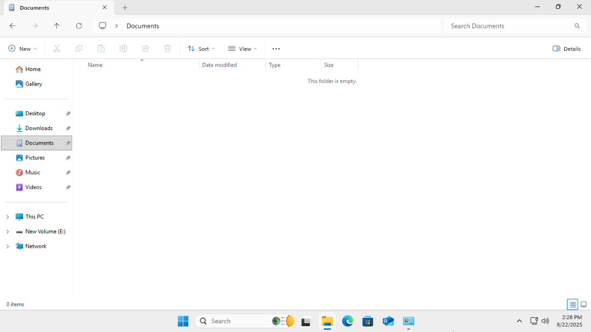

# Lab 03 – Backup & Recovery with File History

## Overview
This lab demonstrates how to **configure backup storage, enable File History, and restore a deleted file** on a Windows 10 workstation. This is a common real‑world Help Desk task to recover files for end users and ensure data protection.

## Steps and Screenshots

### 1. Create and Attach a Virtual Backup Disk

Open VM Settings > Right-click the VM > Settings
Click Add (bottom left). > Choose Hard Disk > Create a new virtual disk

Initialize The New Disk in Windows Disk Management.

### 2. Enable File History with Backup Drive
Navigate to **Control Panel → File History** and backup is enabled using the backup disk (E:).

### 3. Create a Test File in Documents
In the Documents folder, a test file is created.

### 4. Delete the File to Simulate Data Loss
In order to simulate accidental file deletion by a user, the test file is then deleted

### 5. Restore File Using File History
The test file is resoted using **File History → Restore Personal Files** .

 

## Conclusion
This lab successfully demonstrated **File Recovery and Data Backup**

- New virtual disk was created for Data Backup
- File History was enabled to save files in BackupDisk (E:)
- A file was created in Documents folder, then deleted on purpose and was then restored using Windows built‑in recovery feature
